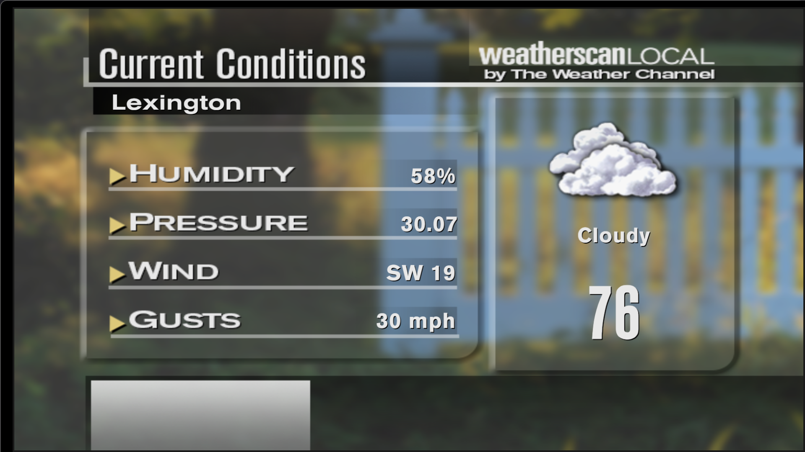
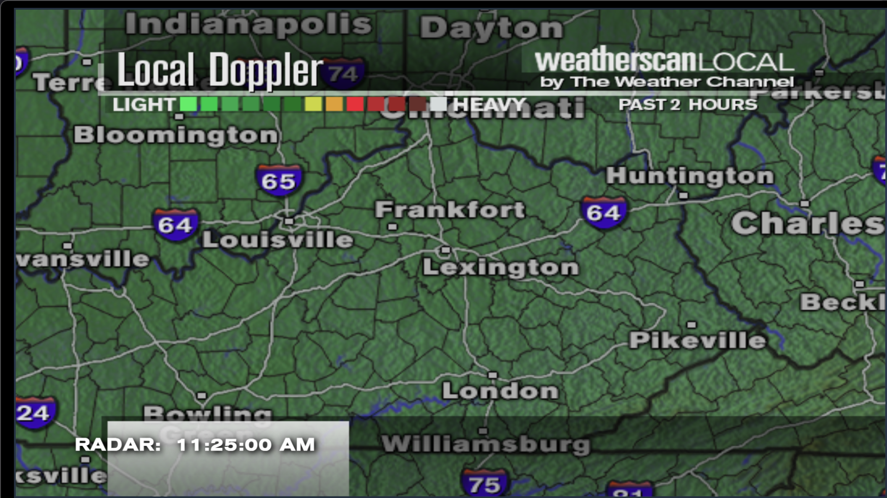
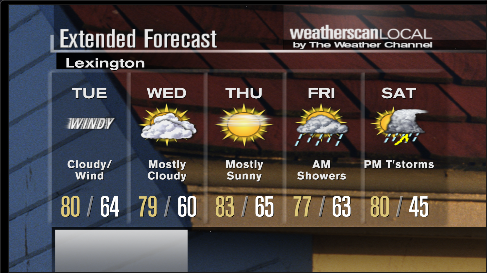
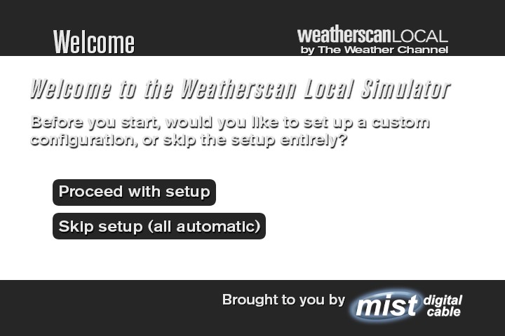

# Weatherscan Local XL

A fan-made recreation of the classic Weatherscan Local experience, built with HTML, CSS, JavaScript, and Node.js.



## Highlights

- Recreates the on-air Weatherscan Local look and pacing for desktop playback.
- Pulls live weather data, animated radar, alerts, almanac details, airports, golf, and more.
- Includes local, extra local, nearby cities, airport, health, golf, and Spanish-language slide groups.
- Ships with built-in sports, standings, schedule, bracket, and news endpoints for richer dashboard content.
- Can run in a browser or inside the included Electron wrapper for a TV-style kiosk experience.

## Screenshots

| Current Conditions | Local Doppler |
| --- | --- |
|  |  |

| Extended Forecast | Setup Wizard |
| --- | --- |
|  |  |

## Quick Start

### Requirements

- Node.js 18 or newer
- A Weather Company API key
- A Mapbox API key

### 1. Install dependencies

```bash
npm install
```

### 2. Create your local config

Copy `webroot/js/config.example.js` to `webroot/js/config.js`, then add your real API keys.

`config.js` is intentionally ignored by Git so your local keys stay out of the repository.

### 3. Start the local server

```bash
npm start
```

The app serves from:

```text
http://127.0.0.1:8080
```

### 4. Optional: run the desktop wrapper

If you want the Electron shell:

```bash
cd electron-wrapper
npm install
cd ..
node launcher.js
```

## Configuration Notes

- The setup wizard can walk through location, airport, golf, and package selection.
- If you prefer JSON-based setup, start from `webroot/configs/templateconfig.json`.
- The simulator is best suited for mainland United States locations.
- Chrome, Edge, and the included Electron wrapper give the most consistent results on Windows.

## Project Layout

```text
.
|-- app.js                   # Express server and data endpoints
|-- launcher.js              # Starts the local server plus Electron wrapper
|-- electron-wrapper/        # Desktop shell
|-- webroot/
|   |-- index.html           # Main simulator UI
|   |-- dashboard.css        # 4-box dashboard styling
|   |-- weatherscan.css      # Classic slide styling
|   |-- js/                  # Client logic, data loading, slides, radar, dashboard
|   |-- images/              # Slide art, maps, provider logos, setup graphics
|   `-- configs/             # JSON setup templates
`-- docs/screenshots/        # GitHub README screenshots
```

## Credits

Special thanks to the Mist Weather Media team and contributors who helped bring the simulator together.

- Joe Molinelli (`TheGoldDiamond9`) - Lead Developer
- COLSTER - Lead Designer / Developer (CSS)
- PicelBoi - Developer (Radar)
- JensonWx - Developer (HTML)
- SSPWXR - Developer (Express Conversion)
- zachNet - Audio Engineer

## Support

Need help, want to share feedback, or just want to talk weather media?

- Discord: [mist weather media](https://discord.gg/hV2w5sZQxz)

## License

This project is released under the terms in [LICENSE](LICENSE).
